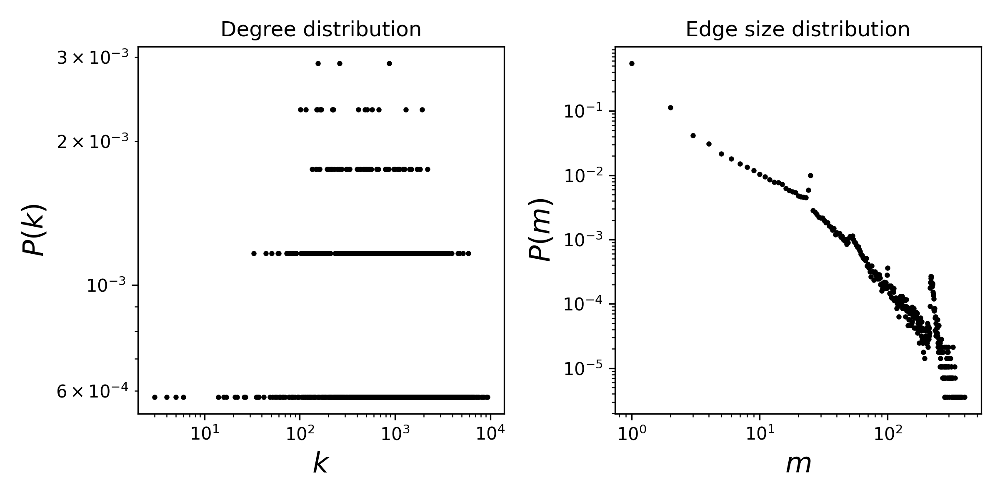

# congress-bills

## Summary
This is a temporal hypergraph dataset, which here means a sequence of timestamped hyperedges where each hyperedge is a set of nodes. In this dataset, nodes are US Congresspersons and hyperedges are comprised of the sponsor and co-sponsors of legislative bills put forth in both the House of Representatives and the Senate. Timestamps are in ISO8601 format. The dataset was derived from James Fowler's data.

## Statistics
Some basic statistics of this dataset are:
* number of nodes: 1,718
* number of timestamped hyperedges: 282,049

<figcaption align = "center"><b>Hypergraph degree and edge size distributions</b></figcaption>

## Source of original data
Source: [congress-bills dataset](https://www.cs.cornell.edu/~arb/data/congress-bills/)

## References
If you use this dataset, please cite these references:
* [Simplicial closure and higher-order link prediction](https://doi.org/10.1073/pnas.1800683115). Austin R. Benson, Rediet Abebe, Michael T. Schaub, Ali Jadbabaie, and Jon Kleinberg. Proceedings of the National Academy of Sciences (PNAS), 2018.
* [Connecting the Congress: A Study of Cosponsorship Networks](https://doi.org/10.1093/pan/mpl002). James H. Fowler. Political Analysis, 2006.
* [Legislative Cosponsorship Networks in the U.S. House and Senate](https://doi.org/10.1016/j.socnet.2005.11.003). James H. Fowler. Social Networks, 2006.