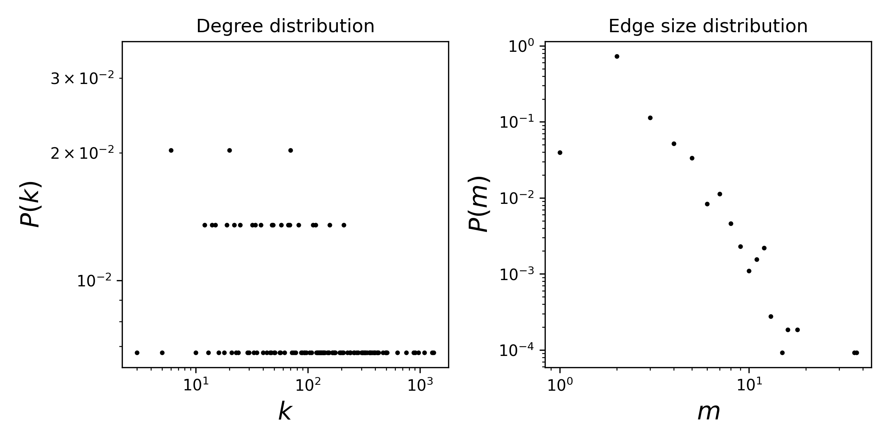

# email-Enron

## Summary

This is a temporal hypergraph dataset, which here means a sequence of timestamped hyperedges where each hyperedge is a set of nodes. In email communication, messages can be sent to multiple recipients. In this dataset, nodes are email addresses at Enron and a hyperedge is comprised of the sender and all recipients of the email. Only email addresses from a core set of employees are included. Timestamps are in ISO8601 format. 

This dataset was collected and prepared by the CALO Project (A Cognitive Assistant that Learns and Organizes). It contains data from about 150 users, mostly senior management of Enron, organized into folders. The corpus contains a total of about 0.5M messages. This data was originally made public, and posted to the web, by the Federal Energy Regulatory Commission during its investigation.

The email dataset was later purchased by Leslie Kaelbling at MIT, and turned out to have a number of integrity problems. A number of folks at SRI, notably Melinda Gervasio, worked hard to correct these problems, and it is thanks to them (not me) that the dataset is available. The dataset here does not include attachments, and some messages have been deleted "as part of a redaction effort due to requests from affected employees". Invalid email addresses were converted to something of the form user@enron.com whenever possible (i.e., recipient is specified in some parse-able format like "Doe, John" or "Mary K. Smith") and to no_address@enron.com when no recipient was specified.

## Statistics
Some basic statistics of this dataset are:
* number of nodes: 148
* number of timestamped hyperedges: 10,885
* distribution of the connected components:

| Component Size  | Number |
| ----- | ---- |
| 143 | 1 |
| 1 | 5 |

* degree and edge size distributions:

<figcaption align = "center"><b>Hypergraph degree and edge size distributions</b></figcaption>

## Source of original data
Source: [email-Enron dataset](https://www.cs.cornell.edu/~arb/data/email-Enron/)

## References
If you use this dataset, please cite these references:
* [Simplicial closure and higher-order link prediction](https://doi.org/10.1073/pnas.1800683115). Austin R. Benson, Rediet Abebe, Michael T. Schaub, Ali Jadbabaie, and Jon Kleinberg. Proceedings of the National Academy of Sciences (PNAS), 2018.
* [Enron Email Dataset](https://www.cs.cmu.edu/~enron/), William Cohen, 2015.