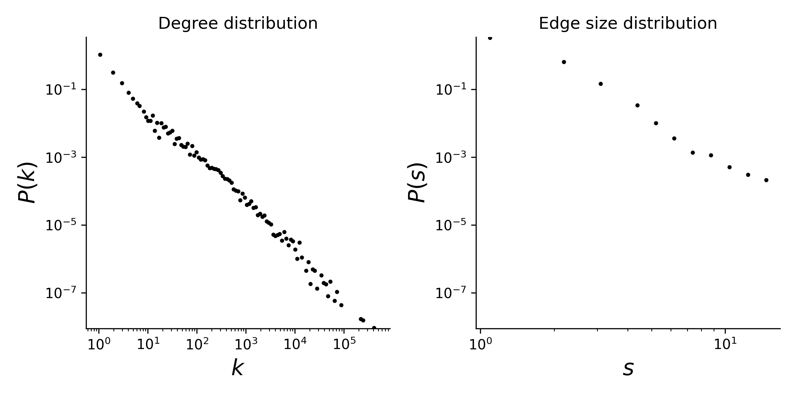

# dawn

The Drug Abuse Warning Network (DAWN) is a national health surveillance system that records drug use contributing to hospital emergency department visits throughout the United States. Hyperedges in this dataset are the drugs used by a patient (as reported by the patient) in an emergency department visit. The drugs include illicit substances, prescription and over-the-counter medication, and dietary supplements. Timestamps of visits (under the `timestamp` attribute of the hyperedges) are recorded at the resolution of quarter-years, spanning a total duration of 8 years (2004 to 2011). The names of the drugs are encoded in the `name` attribute of the nodes.

This is a temporal hypergraph dataset, which here means a sequence of timestamped hyperedges where each hyperedge is a set of nodes. Timestamps are in ISO8601 format. In the original dataset, the same drug substance can have more than one NDC code. For example, different dosages of the same drug may result in multiple NDC codes.

## Statistics
Some basic statistics of this dataset are:
* number of nodes: 2,558
* number of timestamped hyperedges: 2,272,433
* distribution of the connected components:

| Component Size  | Number |
| ----- | ---- |
| 2290 | 1 |
| 1 | 68 |

* degree and edge size distributions:

<figcaption align = "center"><b>Hypergraph degree and edge size distributions</b></figcaption>

## Source of original data
Sources:
* [DAWN dataset](https://www.cs.cornell.edu/~arb/data/DAWN/)

## References
If you use this dataset, please cite these references:
* [Simplicial closure and higher-order link prediction](https://doi.org/10.1073/pnas.1800683115), Austin R. Benson, Rediet Abebe, Michael T. Schaub, Ali Jadbabaie, and Jon Kleinberg. Proceedings of the National Academy of Sciences (PNAS), 2018.