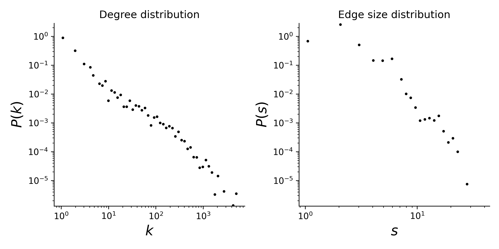

# ndc-classes

## Overview
This dataset consists of the pharmaceutical classes used to classify drugs in
the National Drug Code Directory maintained by the Food and Drug
Administration between 1946 and 2017. The original data was downloaded from
https://www.fda.gov/Drugs/InformationOnDrugs/ucm142438.htm.

This is a temporal hypergraph dataset, which here means a sequence of timestamped hyperedges where each hyperedge is a set of nodes. Timestamps are in ISO8601 format. In the original dataset, the same drug substance can have more than one NDC code. For example, different dosages of the same drug may result in multiple NDC codes.

## Statistics
Some basic statistics of this dataset are:
* number of nodes: 1,161
* number of timestamped hyperedges: 49,726
* distribution of the connected components:

| Component Size  | Number |
| ----- | ---- |
| 628 | 1 |
| 60 | 1 |
| 26 | 1 |
| 18 | 1 |
| 8 | 2 |
| 7 | 3 |
| 6 | 2 |
| 5 | 2 |
| 4 | 11 |
| 3 | 20 |
| 2 | 127 |
| 1 | 12 |

* degree and edge size distributions:

<figcaption align = "center"><b>Hypergraph degree and edge size distributions</b></figcaption>

## Source of original data
Sources:
* [NDC-classes dataset](https://www.cs.cornell.edu/~arb/data/NDC-classes/)
* [FDA](https://www.fda.gov/Drugs/InformationOnDrugs/ucm142438.htm)

## References
If you use this dataset, please cite these references:
* [Simplicial closure and higher-order link prediction](https://doi.org/10.1073/pnas.1800683115), Austin R. Benson, Rediet Abebe, Michael T. Schaub, Ali Jadbabaie, and Jon Kleinberg. Proceedings of the National Academy of Sciences (PNAS), 2018.