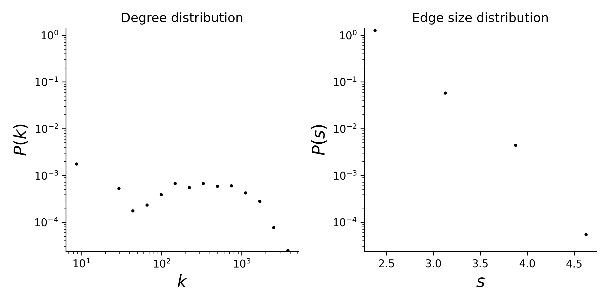

# contact-high-school

## Summary

This is a temporal hypergraph dataset, which here means a sequence of timestamped hyperedges where each hyperedge is a set of nodes. This dataset is constructed from a contact network amongst high school students
in Marseilles, France, in December 2013. The contact network was downloaded from
http://www.sociopatterns.org/datasets/high-school-contact-and-friendship-networks/

We form simplices through cliques of simultaneous contacts. Specifically, for
every unique timestamp in the dataset, we construct a simplex for every maximal
clique amongst the contact edges that exist for that timestamp. Timestamps were
recorded in 20 second intervals.

## Statistics
Some basic statistics of this dataset are:
* number of nodes: 327
* number of timestamped hyperedges: 172,035
* there is a single connected component of size 327

* degree and edge size distributions:

<figcaption align = "center"><b>Hypergraph degree and edge size distributions</b></figcaption>

## Source of original data
Source: [contact-high-school dataset](https://www.cs.cornell.edu/~arb/data/contact-high-school/)

## References
If you use this dataset, please cite these references:
* [Simplicial closure and higher-order link prediction](https://doi.org/10.1073/pnas.1800683115). Austin R. Benson, Rediet Abebe, Michael T. Schaub, Ali Jadbabaie, and Jon Kleinberg. Proceedings of the National Academy of Sciences (PNAS), 2018.
* [Contact Patterns in a High School: A Comparison between Data Collected Using Wearable Sensors, Contact Diaries and Friendship Surveys](https://doi.org/10.1371/journal.pone.0136497). Rossana Mastrandrea, Julie Fournet, and Alain Barrat. PLoS ONE, 2015.