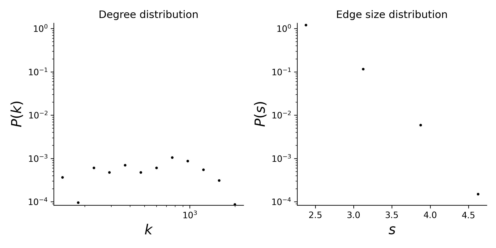

# contact-primary-school

## Summary

This dataset is constructed from a contact network amongst children and teachers
at a primary school. The contact network was downloaded from
http://www.sociopatterns.org/datasets/primary-school-temporal-network-data/

We form simplices through cliques of simultaneous contacts. Specifically, for every unique timestamp in the dataset, we construct a simplex for every maximal clique amongst the contact edges that exist for that timestamp. Timestamps were
recorded in 20 second intervals.

## Statistics
Some basic statistics of this dataset are:
* number of nodes: 242
* number of timestamped simplices: 106,879
* number of unique simplices: 12,799
* number of edges in projected graph: 8,317

* degree and edge size distributions:

<figcaption align = "center"><b>Hypergraph degree and edge size distributions</b></figcaption>

## Source of original data
Source: [contact-primary-school dataset](hhttps://www.cs.cornell.edu/~arb/data/contact-primary-school/)

## References
If you use this dataset, please cite these references:
* [Simplicial closure and higher-order link prediction](https://doi.org/10.1073/pnas.1800683115). Austin R. Benson, Rediet Abebe, Michael T. Schaub, Ali Jadbabaie, and Jon Kleinberg. Proceedings of the National Academy of Sciences (PNAS), 2018.
* [CHigh-Resolution Measurements of Face-to-Face Contact Patterns in a Primary School](https://doi.org/10.1371/journal.pone.0023176). RJuliette Stehlé, Nicolas Voirin, Alain Barrat, Ciro Cattuto, Lorenzo Isella, Jean-François Pinton, Marco Quaggiotto, Wouter Van den Broeck, Corinne Régis, Bruno Lina, and Philippe Vanhems. PLoS ONE, 2011.