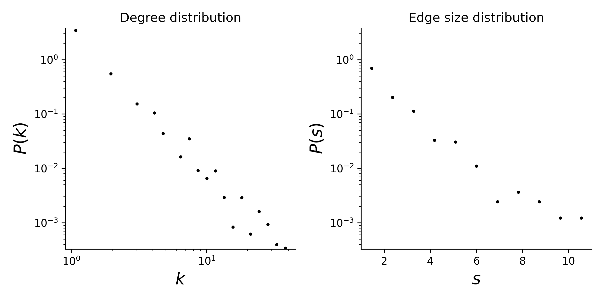

# diseasome

## Summary

This is a dataset of diseases and the genes associated with them. In this dataset, a disease is a node and a gene is a hyperedge. The "label" attribute of the nodes gives the disease description and the "label" attribute of the edges gives the gene name. The disease-disease correlations were filtered out to enforce only disease-gene relationships.

## Statistics
Some basic statistics of this dataset are:
* number of nodes: 516
* number of hyperedges: 903
* The dataset is connected
* degree and edge size distributions:

<figcaption align = "center"><b>Hypergraph degree and edge size distributions</b></figcaption>

## Source of original data
Source: [Gephi](https://github.com/gephi/gephi.github.io/blob/master/datasets/diseasome.gexf.zip)

## References
If you use this dataset, please cite these references:
* [The human disease network](https://doi.org/10.1073/pnas.0701361104). Kwang-Il Goh, Michael E. Cusick, David Valle, and Albert-László Barabási. Proceedings of the National Academy of Sciences (PNAS), 2007.