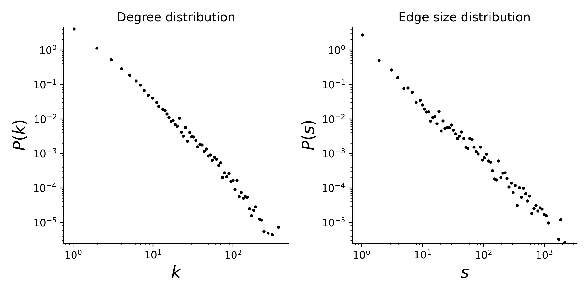

# disgenenet

## Summary

This is a dataset of genes and the diseases associated with them. In this dataset, a gene is a node and a disease is a hyperedge. The "symbol" attribute of the nodes gives the gene name and the "name" attribute of the edges gives the disease name.

## Statistics
Some basic statistics of this dataset are:
* number of nodes: 12368
* number of hyperedges: 2261
* The dataset is connected
* degree and edge size distributions:

<figcaption align = "center"><b>Hypergraph degree and edge size distributions</b></figcaption>

## Source of original data
Source: [DisGeNET](https://www.disgenet.org/)

## References
If you use this dataset, please cite these references:
* [The DisGeNET knowledge platform for disease genomics: 2019 update](https://doi.org/10.1093/nar/gkz1021). Janet Piñero, Juan Manuel Ramírez-Anguita, Josep Saüch-Pitarch, Francesco Ronzano, Emilio Centeno, Ferran Sanz, Laura I Furlong. Nucleic Acids Research, 2019.