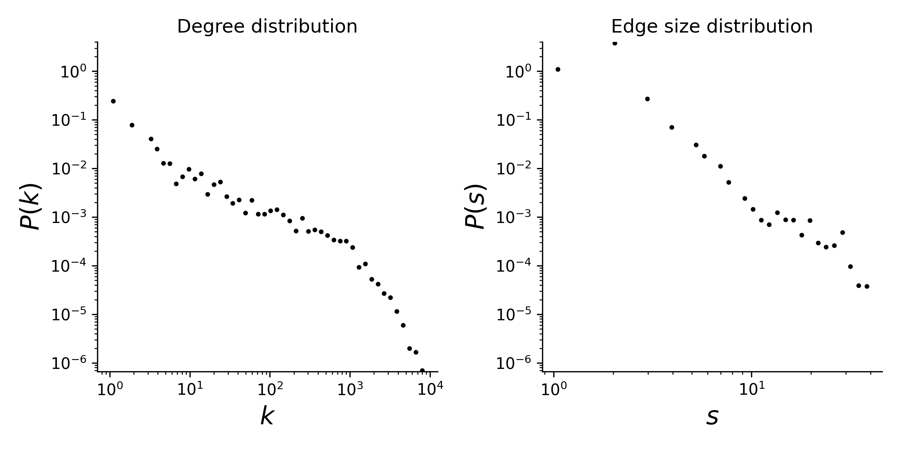

# email-eu

## Overview
This hypergraph dataset was generated using email data from a large European research institution for a period from October 2003 to May 2005 (18 months). Information about all incoming and outgoing email between members of the research institution has been anonymized. The e-mails only represent communication between institution members (the core), and the dataset does not contain incoming messages from or outgoing messages to the rest of the world.

This is a temporal hypergraph dataset, which here means a sequence of timestamped hyperedges where each hyperedge is a set of nodes. Timestamps are in ISO8601 format. In email communication, messages can be sent to multiple recipients. In this dataset, nodes are email addresses at a European research institution. The original data source only contains directed temporal edge tuples (sender, receiver, timestamp), where timestamps are recorded at 1-second resolution. The hyperedges are undirected and consist of a sender and all receivers grouped such that the email between the sender and each receiver has the same timestamp.

## Statistics
Some basic statistics of this dataset are:
* number of nodes: 1,005
* number of timestamped hyperedges: 235,263
* distribution of the connected components:

| Component Size  | Number |
| ----- | ---- |
| 986 | 1 |
| 1 | 19 |

* degree and edge size distributions:

<figcaption align = "center"><b>Hypergraph degree and edge size distributions</b></figcaption>

## Source of original data
Source: [email-Eu dataset](https://www.cs.cornell.edu/~arb/data/email-Eu/)

## References
If you use this dataset, please cite these references:
* [Simplicial closure and higher-order link prediction](https://doi.org/10.1073/pnas.1800683115), Austin R. Benson, Rediet Abebe, Michael T. Schaub, Ali Jadbabaie, and Jon Kleinberg. Proceedings of the National Academy of Sciences (PNAS), 2018.
* [Local Higher-order Graph Clustering](https://doi.org/10.1145/3097983.3098069), Hao Yin, Austin R. Benson, Jure Leskovec, and David F. Gleich. Proceedings of KDD, 2017.
* [Graph Evolution: Densification and Shrinking Diameters](https://doi.org/10.1145/1217299.1217301), Jure Leskovec, Jon Kleinberg, and Christos Faloutsos. ACM Transactions on Knowledge Discovery from Data, 2007.