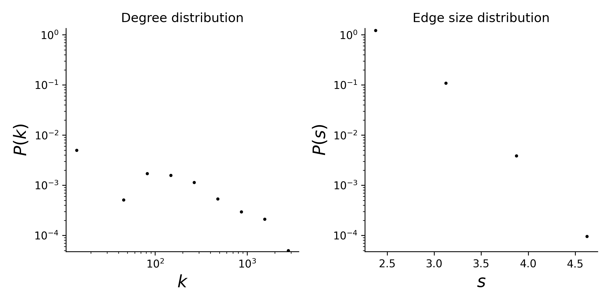

# hospital-lyon

## Summary
This dataset contains the temporal network of contacts between patients, patients and health-care workers (HCWs) and among HCWs in a hospital ward in Lyon, France, from Monday, December 6, 2010 at 1:00 pm to Friday, December 10, 2010 at 2:00 pm. The study included 46 HCWs and 29 patients.

The active contacts are resolved to a 20-second interval in the data collection. In the original data, each line has the form "t i j Si Sj", where i and j are the anonymous IDs of the persons in contact, Si and Sj are their statuses (NUR=paramedical staff, i.e. nurses and nurses’ aides; PAT=Patient; MED=Medical doctor; ADM=administrative staff), and the interval during which this contact was active is [ t – 20s, t ]. If a node is connected to more than one other node at a given time interval, we assume that all these nodes participate in a group interactions, i.e., if nodes 1 and 2 as well as nodes 2 and 3 are active at a given time interval, we assume that 1, 2, and 3 participate in a group interaction together. All timestamps are in standard ISO8601 format.

## Statistics
* number of nodes: 75 (46 HCWs and 29 patients)
* number of timestamped hyperedges: 21,398
* there is a single connected component of size 75
* degree and edge size distributions:

<figcaption align = "center"><b>Hypergraph degree and edge size distributions</b></figcaption>

## Source of original data
Source: [SocioPatterns dataset: Hospital ward dynamic contact network](http://www.sociopatterns.org/datasets/hospital-ward-dynamic-contact-network/)

## References
If you use this dataset, please cite these references:
* [Estimating Potential Infection Transmission Routes in Hospital Wards Using Wearable Proximity Sensors](http://dx.doi.org/10.1371%2Fjournal.pone.0073970). Philippe Vanhems, Alain Barrat, Ciro Cattuto, Jean-François Pinton, Nagham Khanafer, Corinne Régis, Byeul-a Kim, Brigitte Comte, Nicolas Voirin. PLoS ONE, 2013.