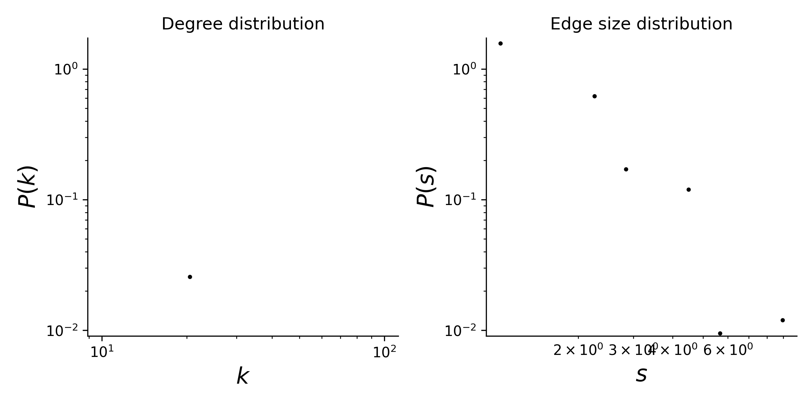

# plant-pollinator-mpl-014

## Summary

This is a hypergraph dataset where nodes are plants species, and hyperedges are pollinator species that visit a given plant. 
Locality of study: Hazen Camp, Ellesmere Island, Canada (latitude: 81.816667 , longitude: -71.3).

## Statistics
Some basic statistics of this dataset are:
* number of nodes: 29
* number of hyperedges: 81
* distribution of the connected components:

| Component Size  | Number |
| ----- | ---- |
| 29 | 1 |
|||

* degree and edge size distributions:

<figcaption align = "center"><b>Hypergraph degree and edge size distributions</b></figcaption>

## Source of original data
Source: [web-of-life](https://www.web-of-life.es/), dataset ID: M_PL_014.

## References
If you use this dataset, please cite these references:
* Hocking, B. (1968). [Insect-flower associations in the high Arctic with special reference to nectar](https://doi.org/10.2307/3565022). *Oikos*, 359-387.

