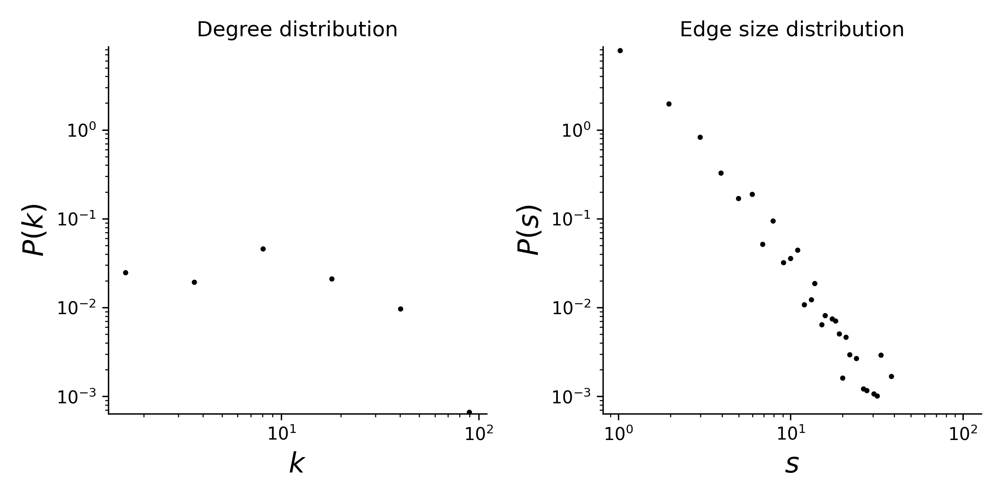

# plant-pollinator-mpl-015

## Summary

This is a hypergraph dataset where nodes are plants species, and hyperedges are pollinator species that visit a given plant. 
Locality of study: Daphní, Athens, Greece (latitude: 38.014466, longitude: 23.635043).

## Statistics
Some basic statistics of this dataset are:
* number of nodes: 131
* number of hyperedges: 666
* distribution of the connected components:

| Component Size  | Number |
| ----- | ---- |
| 130 | 1 |
|1|1|

* degree and edge size distributions:

<figcaption align = "center"><b>Hypergraph degree and edge size distributions</b></figcaption>

## Source of original data
Source: [web-of-life](https://www.web-of-life.es/), dataset ID: M_PL_015.

## References
If you use this dataset, please cite these references:
* Petanidou, T. (1991). [Pollination ecology in a phryganic ecosystem](https://thesis.ekt.gr/thesisBookReader/id/10184#page/1/mode/2up). Unp. PhD. Thesis, Aristotelian University, Thessaloniki.

