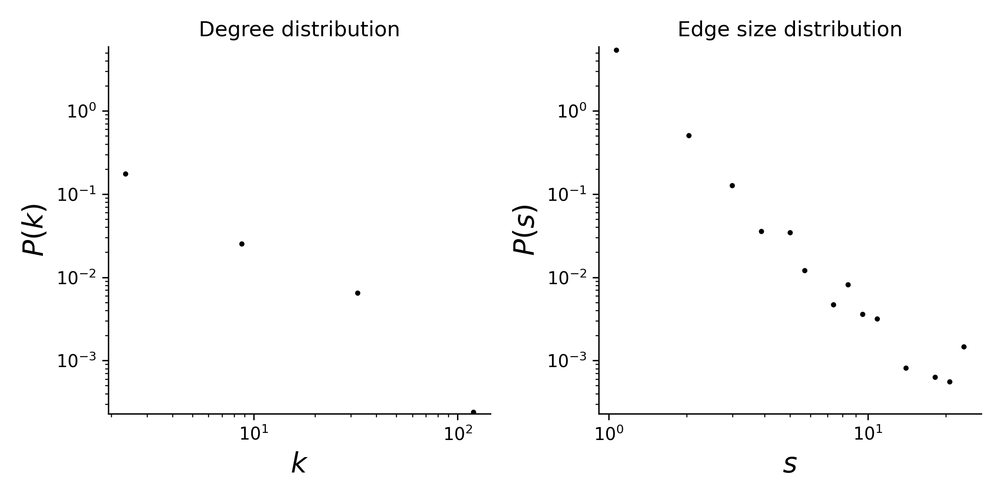

# plant-pollinator-mpl-021

## Summary

This is a hypergraph dataset where nodes are plants species, and hyperedges are pollinator species that visit a given plant. 
Locality of study: Ashu, Kyoto, Japan (latitude: 35.333333 , longitude: 135.75).

## Statistics
Some basic statistics of this dataset are:
* number of nodes: 91
* number of hyperedges: 677
* distribution of the connected components:

| Component Size  | Number |
| ----- | ---- |
| 130 | 1 |
|1|1|

* degree and edge size distributions:

<figcaption align = "center"><b>Hypergraph degree and edge size distributions</b></figcaption>

## Source of original data
Source: [web-of-life](https://www.web-of-life.es/), dataset ID: M_PL_021.

## References
If you use this dataset, please cite these references:
* Kato, M., Kakutani, T., Inoue, T. and Itino, T. (1990). [Insect-flower relationship in the primary beech forest of Ashu, Kyoto: An overview of the flowering phenology and the seasonal pattern of insect visits.](https://repository.kulib.kyoto-u.ac.jp/dspace/bitstream/2433/156101/1/cbl02704_309.pdf) Contrib. Biol. Lab., Kyoto, Univ., 27, 309-375.
