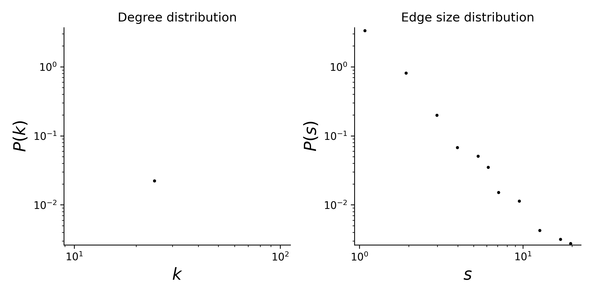

# plant-pollinator-mpl-034

## Summary

This is a hypergraph dataset where nodes are plants species, and hyperedges are pollinator species that visit a given plant. 
Locality of study: Chiloe, Chile (latitude: -42, longitude: -73.583333).

## Statistics
Some basic statistics of this dataset are:
* number of nodes: 26
* number of hyperedges: 128
* distribution of the connected components:

| Component Size  | Number |
| ----- | ---- |
| 130 | 1 |
|1|1|

* degree and edge size distributions:

<figcaption align = "center"><b>Hypergraph degree and edge size distributions</b></figcaption>

## Source of original data
Source: [web-of-life](https://www.web-of-life.es/), dataset ID: M_PL_034.

## References
If you use this dataset, please cite these references:
* Smith-Ramírez C., P. Martinez, M. Nuñez, C. González and J. J. Armesto (2005) [Diversity, flower visitation frequency and generalism of pollinators in temperate rain forests of Chiloé Island,Chile](https://doi.org/10.1111/j.1095-8339.2005.00388.x). Botanical Journal of the Linnean Society, 2005, 147, 399–416.
