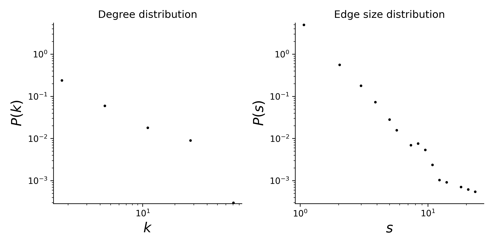

# plant-pollinator-mpl-044

## Summary

This is a hypergraph dataset where nodes are plants species, and hyperedges are pollinator species that visit a given plant. 
Locality of study: Amami-Ohsima Island, Japan (latitude: 28.377248, longitude: 129.493741).

## Statistics
Some basic statistics of this dataset are:
* number of nodes: 110
* number of hyperedges: 609
* distribution of the connected components:

| Component Size  | Number |
| ----- | ---- |
| 130 | 1 |
|1|1|

* degree and edge size distributions:

<figcaption align = "center"><b>Hypergraph degree and edge size distributions</b></figcaption>

## Source of original data
Source: [web-of-life](https://www.web-of-life.es/), dataset ID: M_PL_044.

## References
If you use this dataset, please cite these references:
* Kato M (2000).[Anthophilous insect community and plant-pollinator interactions on Amami Islands in the Ryukyu Archipelago, Japan.](https://repository.kulib.kyoto-u.ac.jp/dspace/bitstream/2433/156116/1/cbl02902_157.pdf) Contr Biol Lab Kyoto Univ 29:157-252.
