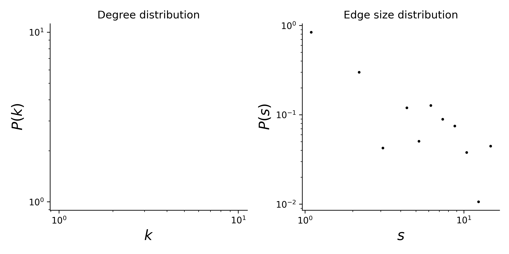

# plant-pollinator-mpl-046

## Summary

This is a hypergraph dataset where nodes are plants species, and hyperedges are pollinator species that visit a given plant. 
Locality of study: Denmark (latitude: 56.066667 longitude: 10.233333).

## Statistics
Some basic statistics of this dataset are:
* number of nodes: 16
* number of hyperedges: 44
* distribution of the connected components:

| Component Size  | Number |
| ----- | ---- |
| 16 | 1 |
|||

* degree and edge size distributions:

<figcaption align = "center"><b>Hypergraph degree and edge size distributions</b></figcaption>

## Source of original data
Source: [web-of-life](https://www.web-of-life.es/), dataset ID: M_PL_046.

## References
If you use this dataset, please cite these references:
* Bundgaard, M. (2003). Tidslig og rumlig variation i et plante-bestøvernetværk. Msc thesis. University of Aarhus. Aarhus, Denmark.
