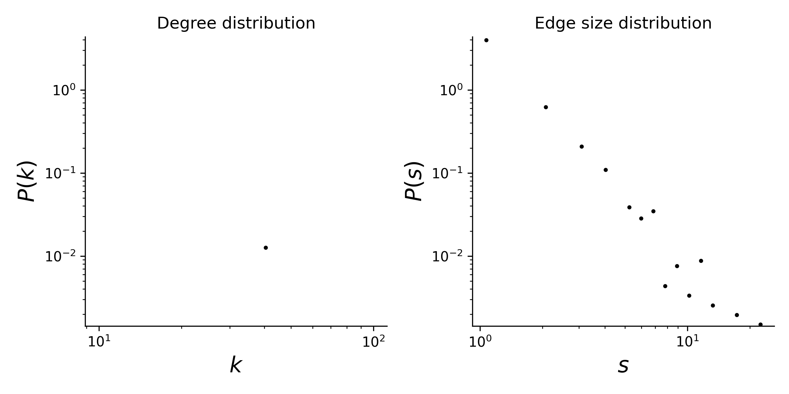

# plant-pollinator-mpl-016

## Summary

This is a hypergraph dataset where nodes are plants species, and hyperedges are pollinator species that visit a given plant. 
Locality of study: Doñana Nat. Park, Spain (latitude: 37.016667, longitude: -6.55).

## Statistics
Some basic statistics of this dataset are:
* number of nodes: 26
* number of hyperedges: 179
* distribution of the connected components:

| Component Size  | Number |
| ----- | ---- |
| 26 | 1 |

* degree and edge size distributions:

<figcaption align = "center"><b>Hypergraph degree and edge size distributions</b></figcaption>

## Source of original data
Source: [web-of-life](https://www.web-of-life.es/), dataset ID: M_PL_016.

## References
If you use this dataset, please cite these references:
* Herrera, J. (1988) [Pollination relatioships in southern spanish mediterranean shrublands.](https://www.jstor.org/stable/2260469) Journal of Ecology 76: 274-287.
