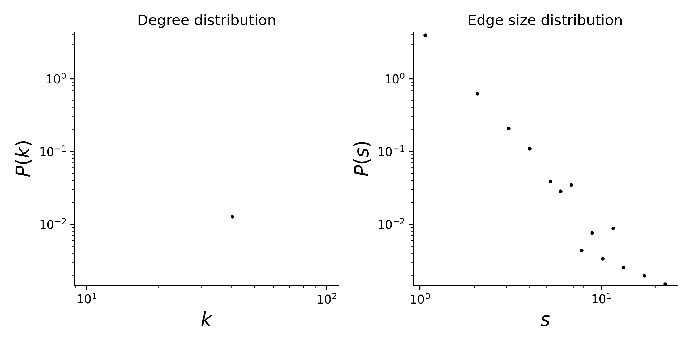

# plant-pollinator-mpl-049

## Summary

This is a hypergraph dataset where nodes are plants species, and hyperedges are pollinator species that visit a given plant. 
Locality of study: Denmark (latitude: 56.066667, longitude: 10.216667).

## Statistics
Some basic statistics of this dataset are:
* number of nodes: 37
* number of hyperedges: 225
* distribution of the connected components:

| Component Size  | Number |
| ----- | ---- |
| 37 | 1 |

* degree and edge size distributions:

<figcaption align = "center"><b>Hypergraph degree and edge size distributions</b></figcaption>

## Source of original data
Source: [web-of-life](https://www.web-of-life.es/), dataset ID: M_PL_049.

## References
If you use this dataset, please cite these references:
* Bek S (2006). A pollination network from a Danish forest meadow. MSc thesis (Univ of Aarhus, Aarhus, Denmark).
