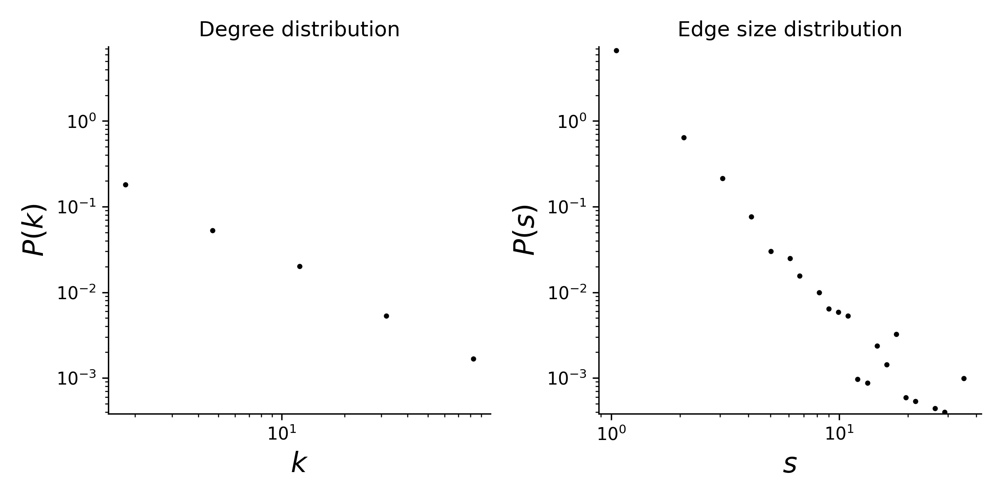

# plant-pollinator-mpl-057

## Summary

This is a hypergraph dataset where nodes are plants species, and hyperedges are pollinator species that visit a given plant. 
Locality of study: Kibune, Kyoto, Japan (latitude: 35.166667, longitude: 135.866667).

## Statistics
Some basic statistics of this dataset are:
* number of nodes: 114
* number of hyperedges: 883
* distribution of the connected components:

| Component Size  | Number |
| ----- | ---- |
| 114 | 1 |
|||

* degree and edge size distributions:

<figcaption align = "center"><b>Hypergraph degree and edge size distributions</b></figcaption>

## Source of original data
Source: [web-of-life](https://www.web-of-life.es/), dataset ID: M_PL_057.

## References
If you use this dataset, please cite these references:
* Inoue et al 1990. [Insect-flower Relationship in the Temperate Deciduous Forest of Kibune, Kyoto : An Overview of the Flowering Phenology and the Seasonal Pattern of Insect Visits.](https://repository.kulib.kyoto-u.ac.jp/dspace/bitstream/2433/156100/1/cbl02704_377.pdf)
