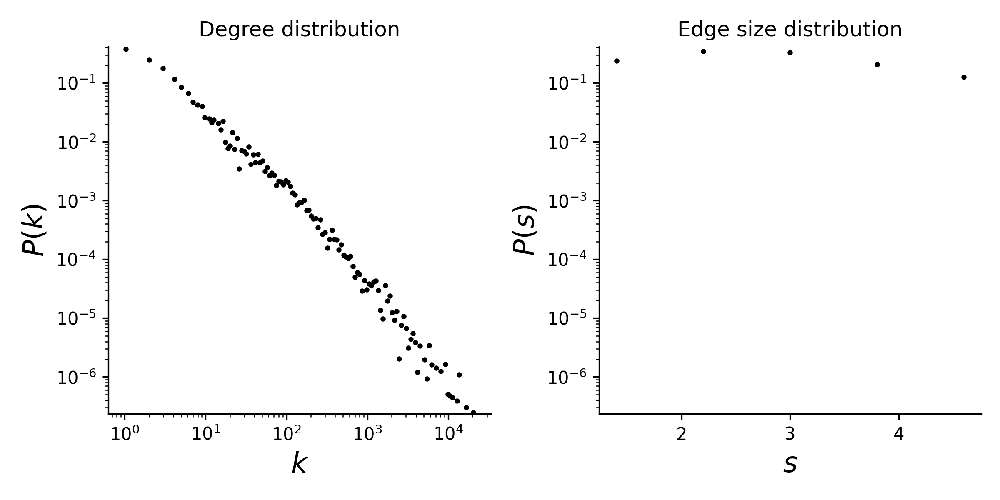

# tags-ask-ubuntu

## Summary
This is a temporal hypergraph dataset, which here means a sequence of timestamped hyperedges where each hyperedges is a set of nodes. In this dataset, nodes are tags and hyperedges are the sets of tags applied to questions on askubuntu.com. The timestamps are in ISO8601 format and are normalized to start at 0. This dataset is derived from tags on Ask Ubuntu posts. The raw data was downloaded from https://archive.org/details/stackexchange

## Statistics
Some basic statistics of this dataset are:
* number of nodes: 3,029
* number of timestamped hyperedges: 271,233
* distribution of the connected components:

| Component Size  | Number |
| ----- | ---- |
| 3021 | 1 |
| 1 | 8 |

* degree and edge size distributions:

<figcaption align = "center"><b>Hypergraph degree and edge size distributions</b></figcaption>

## Source of original data
Source: [tags-ask-ubuntu dataset](https://www.cs.cornell.edu/~arb/data/tags-ask-ubuntu/)

## References
If you use this dataset, please cite these references:
* [Simplicial closure and higher-order link prediction](https://doi.org/10.1073/pnas.1800683115). Austin R. Benson, Rediet Abebe, Michael T. Schaub, Ali Jadbabaie, and Jon Kleinberg. Proceedings of the National Academy of Sciences (PNAS), 2018.